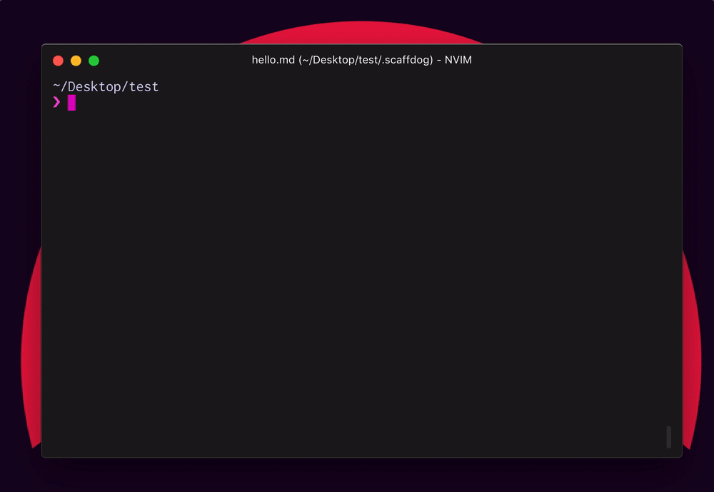

# scaffdog

[](https://www.npmjs.com/package/scaffdog)
[](https://circleci.com/gh/cats-oss/scaffdog)

> :dog: `scaffdog` is Markdown driven scaffolding tool.

## Table of Contents

- [Description](#description)
- [Features](#features)
- [Getting Started](#getting-started)
  - [Installation](#installation)
  - [Quick Start](#quick-start)
- [Commands](#commands)
  - [`scaffdog init`](#scaffdog-init)
  - [`scaffdog generate`](#scaffdog-generate)
  - [`scaffdog template`](#scaffdog-template)
  - [`scaffdog list`](#scaffdog-list)
- [Templates](#templates)
  - [Structure](#structure)
  - [Syntax](#syntax)
  - [Pipe chain](#pipe-chain)
  - [Attributes](#attributes)
  - [Variables](#variables)
  - [Functions](#functions)
- [Contributing](#contributing)
  - [Development scripts](#development-scripts)
- [TODO](#todo)
- [License](#license)

## Description



This is Markdown driven scaffolding tool. Multiple files can be output in one classification, and flexible scaffolding is possible with a simple but powerful template syntax :dog2:

## Features

- :pencil: Markdown driven
  - You can define a template with `<h1>` and code block.
  - It will be a Documetable template !
  - Define meta information with extended syntax using [Front Matter](https://jekyllrb.com/docs/front-matter/).
- :hammer_and_pick: Simple & Powerful template syntax
  - A simple syntax similar to mustache.js. (`{{ input }}`)
  - Function execution similar to pipe syntax. (`{{ input | fn }}`)
  - Provide minimum necessary functions in built-in.
- :rocket: Ready to use
  - You can quickly start using `$ scaffdog init`.

## Getting Started

### Installation

`scaffdog` can be installed globally, but we recommend installing it locally on the project.

```bash
$ yarn add -D scaffdog
```

### Quick Start

In the following tutorial you can start using `scaffdog` immediately !

#### Initialize

By default, it stores the template file in the directory `.scaffdog`.

Creating directories and initial templates can be done with the `init` subcommand.

```bash
$ yarn scaffdog init
```

This will create a file called `.scaffdog / hello.md`. Let's scaffold immediately using the `hello` template!

```bash
$ yarn scaffdog generate hello

? Please select the output destination directory. .
? Please enter any text. pretty-dog

✨ Completed scaffolding !

    ✔ pretty-dog.md

```

Congratulations :tada: The first file was created.

```bash
$ cat pretty-dog.md

Let's create a template with reference to the document!
https://github.com/cats-oss/scaffdog/#templates
```

After this, please customize the `hello.md` template with reference to the document and try to see if you can do what you expect. :+1:

## Commands

### `scaffdog init`

Prepare for using scaffdog. By default it creates a `.scaffdog` directory and creates a simple template.

```bash
USAGE
  $ scaffdog init

OPTIONS
  -d, --templateDir=templateDir  [default: .scaffdog] Directory where to load scaffdog templates from.
  -h, --help                     show CLI help
```

### `scaffdog generate`

Scaffold using the specified template. If you do not specify the template name and execute it, interactively select the template.

```bash
USAGE
  $ scaffdog generate [TEMPLATENAME]

OPTIONS
  -d, --templateDir=templateDir  [default: .scaffdog] Directory where to load scaffdog templates from.
  -h, --help                     show CLI help
  -n, --dryRun                   Output the result to stdout.
```

### `scaffdog template`

Creating a template with the specified name.

```bash
USAGE
  $ scaffdog template NAME

ARGUMENTS
  NAME  Template name.

OPTIONS
  -d, --templateDir=templateDir  [default: .scaffdog] Directory where to load scaffdog templates from.
  -h, --help                     show CLI help
```

### `scaffdog list`

Print a list of available templates.

```bash
USAGE
  $ scaffdog list

OPTIONS
  -d, --templateDir=templateDir  [default: .scaffdog] Directory where to load scaffdog templates from.
  -h, --help                     show CLI help
```

## Templates

### Structure

Templates are defined with `<h1>` and code blocks. `<h1>` is interpreted as the file name and code blocks as the template body.

Meta information is defined using [Front Matter](https://jekyllrb.com/docs/front-matter/).

````markdown
---
name: 'utility'
description: 'Generate Utility function.'
message: 'Please enter a file name.'
root: 'src/utils'
output: '**/*'
ignore: []
---

# `{{ input }}.js`

```javascript
export const {{ input | camel }} = () => true;
```

# `__tests__/{{ input }}.test.js`

```javascript
import { {{ input | camel }} } from '../{{ input }}';

describe('{{ input | camel }}', () => {
  test('__TODO__', () => {
    expect({{ input | camel }}()).toBe(true);
  });
});
```
````

### Syntax

Between `{{` and `}}` is interpreted as a tag. Whitespace in tag contents is ignored.

#### Output of variable

The given variable name is output. See the [Variables](#variables) section for the variables that can be used.

```
{{ <identifier> }}
```

Example:

```
{{ input }}
```

#### Call function

Execute the function with the specified name. Arguments are separated by whitespace. See the [Functions](#functions) section for the functions that can be used.

```
{{ <function> <argument> ... }}
```

Example:

```
{{ relative "../" }}
```

### Pipe chain

You can chain output values or function results with pipes. This is a function similar to shell.

```
{{ <identifier> | <function> }}
{{ <identifier> | <function> <argument> ... }}
```

Example:

```
{{ input | upper }}
{{ input | replace "$.ts" ".js" | pascal }}
{{ basename | replace extname ".js" | pascal }}
```

### Attributes

List of attributes that can be specified with Front Matter.

| key           | required | type       | description                                                                                                                       |
| :------------ | :------- | :--------- | :-------------------------------------------------------------------------------------------------------------------------------- |
| `name`        | `true`   | `string`   | Name of template.                                                                                                                 |
| `description` | `false`  | `string`   | Description of template.                                                                                                          |
| `message`     | `true`   | `string`   | Message to display when accepting input.                                                                                          |
| `root`        | `false`  | `string`   | The directory as the starting point of the output destination.                                                                    |
| `output`      | `true`   | `string`   | Directory starting from `root` and being a destination candidate. You can use glob syntax. (see [globby][glob-patterns] document) |
| `ignore`      | `false`  | `string[]` | Directory to exclude from candidate output destination. You can use glob syntax. (see [globby][glob-patterns] document)           |

[glob-patterns]: https://github.com/sindresorhus/globby#globbing-patterns

### Variables

List of variables available in the template. You need to be aware that the file name and the variables available in the template body are different.

#### File name

| key     | description                               | example    |
| :------ | :---------------------------------------- | :--------- |
| `input` | The value received at the prompt.         | `scaffdog` |
| `root`  | The `root` value specified in Attributes. | `src`      |

#### Template body

| key        | description                                                      | example           |
| :--------- | :--------------------------------------------------------------- | :---------------- |
| `input`    | The value received at the prompt.                                | `scaffdog`        |
| `basename` | The name of the output destination file including the extension. | `scaffdog.js`     |
| `filename` | The name of the output destination file excluding the extension. | `scaffdog`        |
| `extname`  | The destination file name extension.                             | `.js`             |
| `root`     | The `root` value specified in Attributes.                        | `src`             |
| `output`   | The path of the destination file.                                | `src/scaffdog.js` |

### Functions

When invoked on a pipe, the previous processing result is passed to the first argument.

| name       | arguments                                               | description                                                                                                         |
| :--------- | :------------------------------------------------------ | :------------------------------------------------------------------------------------------------------------------ |
| `camel`    | `[value: string]`                                       | Conversion to a camel case.                                                                                         |
| `snake`    | `[value: string]`                                       | Conversion to a snake case.                                                                                         |
| `pascal`   | `[value: string]`                                       | Conversion to a pascal case.                                                                                        |
| `kebab`    | `[value: string]`                                       | Conversion to a kebab case.                                                                                         |
| `constant` | `[value: string]`                                       | Conversion to a constant case.                                                                                      |
| `upper`    | `[value: string]`                                       | Conversion to a upper case.                                                                                         |
| `lower`    | `[value: string]`                                       | Conversion to a lower case.                                                                                         |
| `replace`  | `[value: string, pattern: string, replacement: string]` | Replace `pattern` with`replacement`. `pattern` is specified as a string, but it is treated as a regular expression. |
| `eval`     | `[code: string]`                                        | Executes the specified code and returns the result.                                                                 |
| `relative` | `[path: string]`                                        | Convert the path from the template file to the path from the destination file.                                      |
| `read`     | `[path: string]`                                        | Read the specified file. The contents of the loaded file are also expanded as a template.                           |

## Contributing

We are always welcoming your contribution :clap:

1. Fork (https://github.com/cats-oss/scaffdog) :tada:
1. Create a feature branch :coffee:
1. Run test suite with the `$ yarn test` command and confirm that it passes :zap:
1. Commit your changes :memo:
1. Rebase your local changes against the `master` branch :bulb:
1. Create new Pull Request :love_letter:

Bugs, feature requests and comments are more than welcome in the [issues](https://github.com/cats-oss/scaffdog/issues).

### Development scripts

#### `yarn test`

Run Unit test with [ava](https://github.com/avajs/ava).

```bash
$ yarn test
```

#### `yarn lint`

Run lint with [TSLint](TSLint).

```bash
$ yarn lint
```

#### `yarn format`

Run formatting with [TSLint](TSLint) (`--fix`) and [Prettier](https://github.com/prettier/prettier).

```bash
$ yarn format
```

## TODO

- [ ] Custom functions

## License

[MIT © Cyberagent, Inc](./LICENSE)


